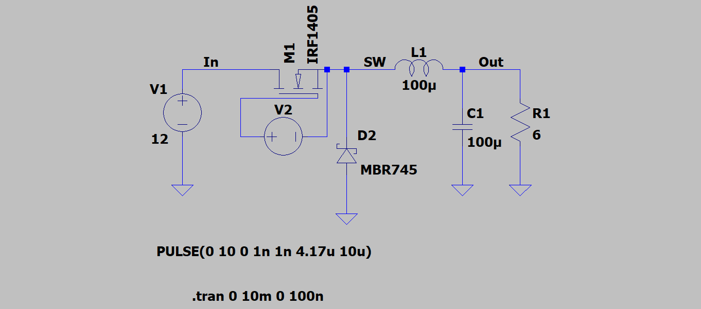
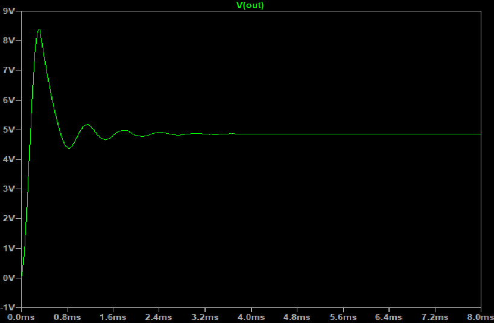
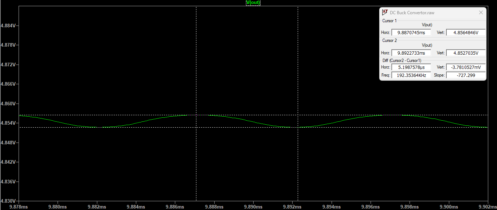
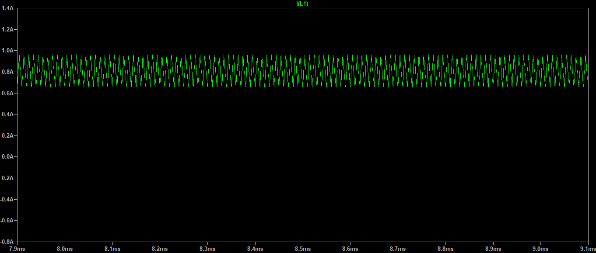
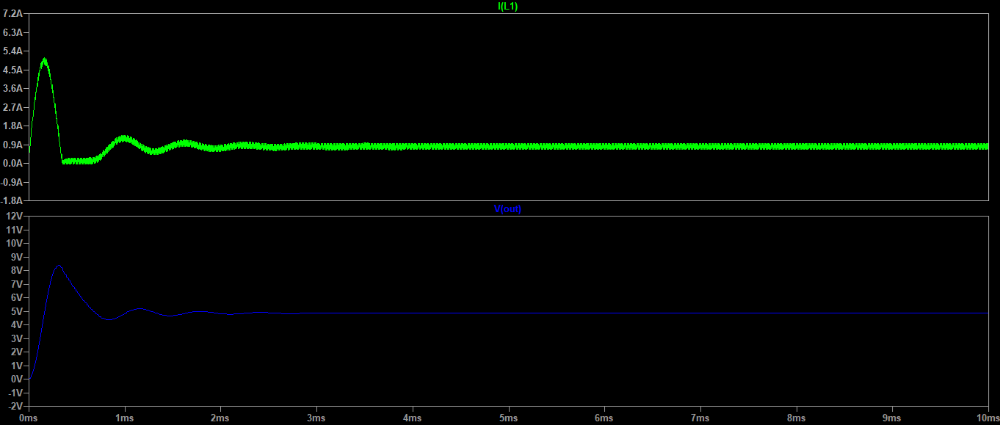
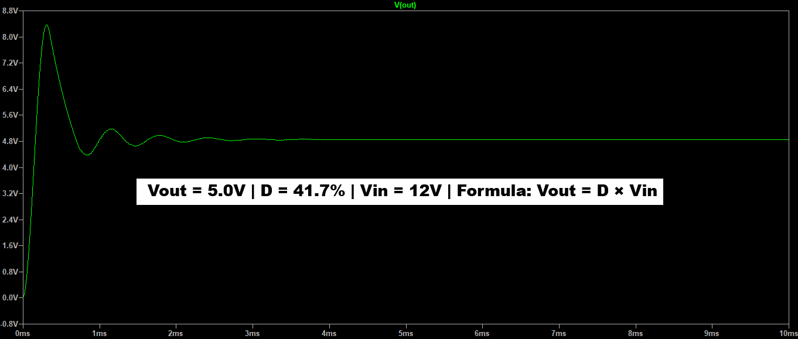

# Buck Converter Simulation — LTspice

Simulation and verification of a 12V → 5V DC-DC buck step-down converter designed and analyzed in LTspice using a high-efficiency IRF1405 power MOSFET.

## Design Specifications

| Parameter         | Value     |
|-------------------|-----------|
| Input voltage     | 12V       |
| Output voltage    | 5V        |
| Switching freq    | 100kHz    |
| Duty cycle        | 41.7%     |
| Inductor          | 100µH     |
| Output capacitor  | 100µF     |
| Load resistor     | 6Ω        |

## Results

| Measurement           | Value       |
|-----------------------|-------------|
| Measured Vout         | 4.856V      |
| Output ripple (Vpp)   | 3.78mV      |
| Theoretical Vout      | 5.004V      |
| Error                 | 2.96%       |

## Key Waveforms

### Circuit Schematic

### Output Voltage Transient Response

### Peak-to-Peak Output Voltage Ripple (3.78mV)

### Inductor Current Sawtooth (CCM Mode)

### Time-Aligned Combined Waveforms

### Mathematical Duty Cycle Validation

## Key Technical Takeaways
- **Converter Dynamics:** Verified open-loop step-down functionality where output voltage is tightly governed by the switching duty cycle (Vout = D × Vin).
- **Continuous Conduction Mode (CCM):** Confirmed CCM operation via inductor current waveform analysis, with ripples shifting cleanly between 0.65A and 0.95A without dropping to zero.
- **Filtering Optimization:** Achieved an exceptionally low output voltage ripple of 0.078% (3.78mV peak-to-peak) utilizing an optimized LC filter network (100µH / 100µF).
- **Simulation Proficiency:** Developed an end-to-end simulation pipeline in LTspice involving transient command optimizations (.tran), cursor-based differential signal debugging, and custom component profiling.
